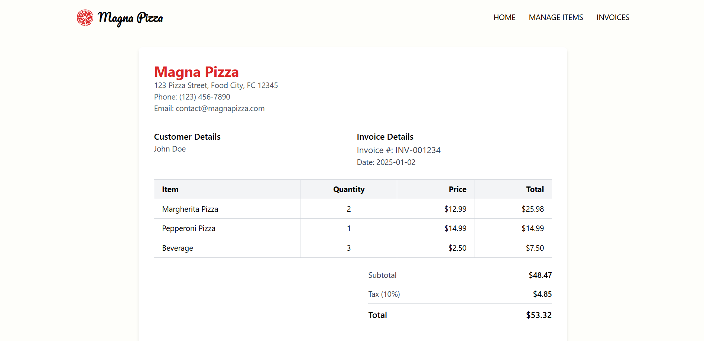

# Pizza Shop Management Web Application

## **Summary**

The Pizza Shop Management Web Application is a full-stack solution designed to streamline the operations of a pizza shop. It provides features to manage items, create and view invoices, and handle inventory efficiently. The web application is responsive, user-friendly, and supports seamless integration between the frontend and backend.

## **Features**

1. **Item Management**:

   - Add, edit, delete, and view items (e.g., pizzas, beverages).
   - Manage item details such as name, type, and price.

2. **Invoice Management**:

   - Create invoices by selecting items, specifying quantities, and calculating taxes.
   - View detailed invoices with breakdowns of items, quantities, prices, and taxes.
   - Print invoices directly from the web application.

## **Technologies Used**

### **Frontend**:

- **React.js**: For building the user interface.
- **Tailwind CSS**: For responsive and modern styling.
- **Axios**: For making API requests.

### **Backend**:

- **Go (Golang)**: For handling server-side logic.
- **PostgreSQL**: For database management.

### **Tools**:

- **Postman**: For API testing.
- **pgAdmin**: For managing the PostgreSQL database.

## **Folder Structure**

```plaintext
server/
├── controllers/
├── models/
├── routes/
├── services/
├── main.go

client/
├── src/
│   ├── components/
│   ├── pages/
│   ├── App.js
│   ├── index.js
├── public/
```

## **Instructions to Run the Application**

### **Backend Setup**

1. **Clone the repository**:

   ```bash
   git clone https://github.com/SkDev22/Pizza_Shop_Project.git
   cd Pizza-Shop-Project/server
   ```

2. **Install dependencies**:

   ```bash
   go mod tidy
   ```

3. **Set up the database**:

   - Import the provided database backup file `pizza_shop_db` to the PostgreSQL database.

4. **Run the backend server**:

   ```bash
   .\main.exe
   ```

   The server will start on `http://localhost:8080`.

### **Frontend Setup**

1. **Navigate to the frontend directory**:

   ```bash
   cd ../frontend
   ```

2. **Install dependencies**:

   ```bash
   npm install
   ```

3. **Run the development server**:

   ```bash
   npm run dev
   ```

   The app will start on `http://localhost:5173`

   - If you want to see the app in your mobile phone, please type the `URL` named `Network` showing in the terminal in your mobile phone's browser.

## **Screenshots**

### Home Page

<!--  -->


<!--  -->

### Item List

<!--  -->


### Invoice Management

<!--  -->


### Printable Invoice



### Mobile Screens


